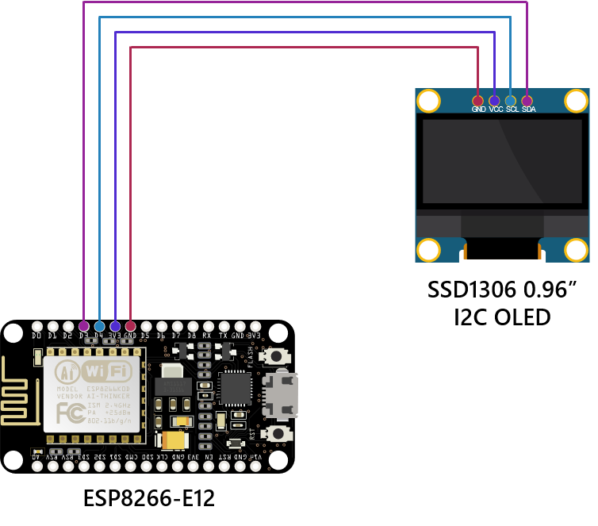

# BusInfoSystem
Bus Information System for Gyeonggi Province, South Korea. NodeMCU (ESP8266) has been used as the main microcontroller unit, estimated arrival time calculated based on the real-time bus location data retrieved from the server once every 20 seconds. Displays refined information on the OLED Screen. 

 

## What's New

Click to Expand

### v1.0
#### August 25, 2020  
Initial release.

#### August 26, 2020  
Added Open API document which the Government of South Korea provides.  
Modified variables to be consistent with bus route numbers.

#### August 29, 2020
Bug Fixed : When there are "no buses in service," the variable "rcvbuf" is not cleared.

### v2.0
#### May 12, 2021
Now supports modified API and renewaled endpoint URL.

#### July 1, 2023
Improvements were made to serial logs to display more clearly.

### v3.0
#### January 12, 2025
Now supports modified API and renewaled endpoint URL.  
Bugs fixed.

#### February 9, 2025
Enhanced the system to dynamically retrieve bus route numbers from the API.  
Improved the system to display an error message if the server fails to respond due to an error.  
Bugs fixed.

## Specifications
### Scenarios
- Estimated arrival time calculated based on the real-time bus location data retrieved from the server once every 20 seconds. Displays refined information on the OLED Screen.

### Connections
- 1 x Micro-USB

### Wireless
- IEEE 802.11 b/g/n Wi-Fi Technology

## Apparatus (Equipment)
### Platform
- ESP8266 NodeMCU

### 0.96" SSD1306 I2C OLED Display 
* Soldering required
* D3 : Data, D4 : Clock

### KOKIRI A-PACK FIXIE 5 (KP-LS50) Portable Battery
* USB Port : Power
* Micro-USB : Charging Port
* Dimension : 62.3 mm (W) × 112.0 mm (D) × 13.0 mm (H)
* Weight : 120 g
* Input : DC-5V / 2A
* Output : DC-5V / 2.1A
* Capacity : 5000 mAh

## Schematics
   

  

## Data Usage
**718 bytes per API Call.**  
718 x 3 = **2,154 bytes. (3 bus routes have been used in this project.)**

86,400 ÷ 20 = **4,320 times API calls in a day.**  
4,320 * 2,154 = **9,305,280 bytes**.  
Approximately uses **9.30 MB per day.** (**280 MB per month.**)

## APIs Used
### Gyeonggi bus route inquiry API.
https://www.data.go.kr/tcs/dss/selectApiDataDetailView.do?publicDataPk=15080666
- Provides the route ID, route type, and operating area of the route number.
- Provides a list of stops via which the corresponding line stops, the name of the stop, whether the center lane is located, the turnaround point, and coordinate values.

### Gyeonggi bus arrival information inquiry API.
https://www.data.go.kr/tcs/dss/selectApiDataDetailView.do?publicDataPk=15080346
- Provides location information, estimated arrival time, vacant seats, and low-floor bus information of the first and second scheduled buses for a specific route stopping at the corresponding stop.

### Incheon bus route inquiry API.
https://www.data.go.kr/tcs/dss/selectApiDataDetailView.do?publicDataPk=15058487
- Provides the route ID, route type, and operating area of the route number.
- Provides a list of stops via which the corresponding line stops, the name of the stop, whether the center lane is located, the turnaround point, and coordinate values.

### Incheon bus arrival information inquiry API.
https://www.data.go.kr/tcs/dss/selectApiDataDetailView.do?publicDataPk=15059084
- Provides location information, estimated arrival time, vacant seats, and low-floor bus information of the first and second scheduled buses for a specific route stopping at the corresponding stop.

