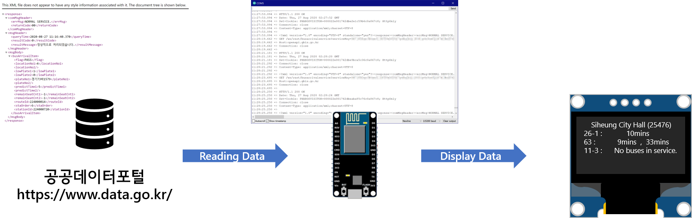

# BusInfoSystem
Bus Information System for Gyeonggi Province, South Korea. NodeMCU (ESP8266) has been used as main microcontroller unit, estimated arrival time calculated based on the real time bus location data retrieves from the server once 20 seconds. Displays refined information on the OLED Screen. 

## Schematics

## What's New

Click to Expand

### v1.0
#### August 25, 2020  
Initial release.

#### August 26, 2020  
Added Open API document which provided by the Government of South Korea.  
Modified variables to consistent with bus route numbers.

#### August 29, 2020
Fixed bug : When there is "no buses in service", doesn't clear the variable "rcvbuf".

## API Keys
### Bus route inquiry API.
https://www.data.go.kr/tcs/dss/selectApiDataDetailView.do?publicDataPk=15058051
- Provides the route ID, route type, and operating area of the route number.
- Provides a list of stops via which the corresponding line stops, the name of the stop, whether the center lane is located, the turnaround point, and coordinate values.

### Bus arrival information inquiry API.
https://www.data.go.kr/tcs/dss/selectApiDataDetailView.do?publicDataPk=15058837
- Provides location information, estimated arrival time, vacant seats, and low-floor bus information of the first and second scheduled buses for a specific route stopping at the corresponding stop

## Specifications
### Connections
- 1 x Micro-USB

### Wireless
- IEEE 802.11 b/g/n Wi-Fi Technology

## Apparatus (Equipment)
### Platform
- ESP8266 NodeMCU

### 0.96" SSD1306 I2C OLED Display
- Soldering Required
- D4 : Data, D3 : Clock

### KOKIRI A-PACK FIXIE 5 (KP-LS50) Portable Battery
* USB Port : Power
* Micro-USB : Charging Port
* Dimension : 62.3 mm (W) × 112.0 mm (D) × 13.0 mm (H)
* Weight : 120 g
* Input : DC-5V / 2A
* Output : DC-5V / 2.1A
* Capacity : 5000 mAh

## Known Issues
Takes long time to load after the first boot. 
